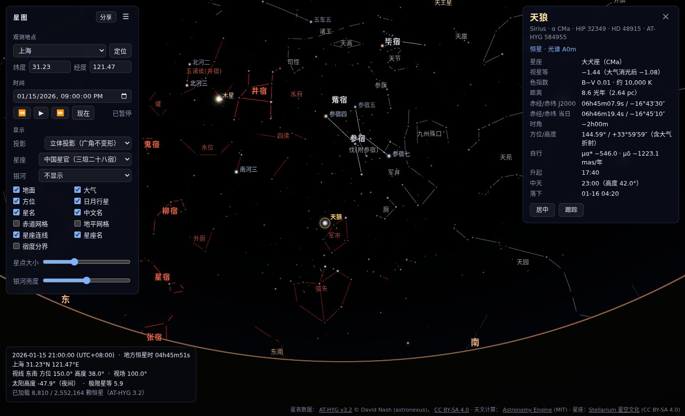
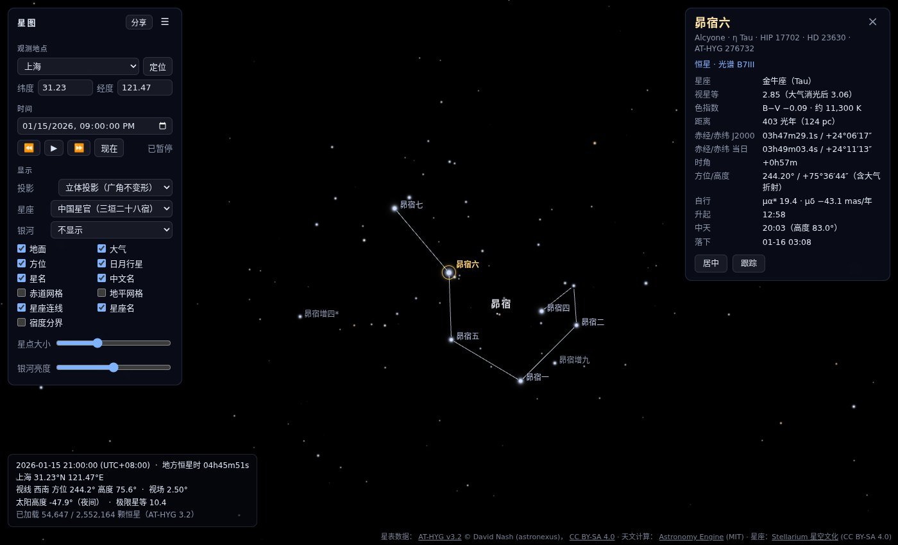
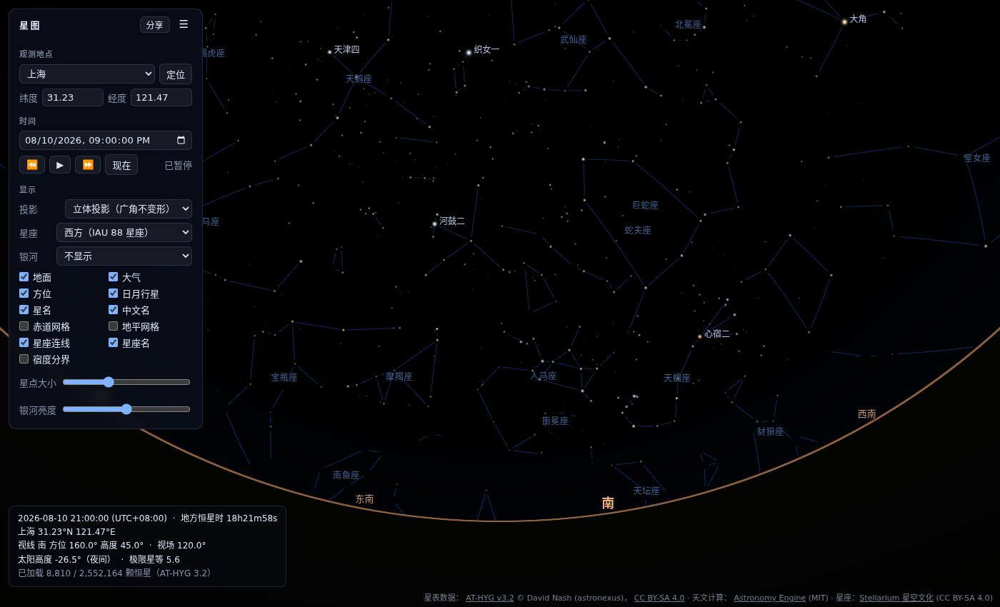

# 星图 xingtu

浏览器里的天象仪，类似 Stellarium Web。技术栈是 Vite + TypeScript（strict）+ Three.js 自定义着色器 + [astronomy-engine](https://github.com/cosinekitty/astronomy)。

**在线访问：<https://strengthening.github.io/xingtu/>**（由 GitHub Actions 从本分支构建并发布到 GitHub Pages，见下文“部署”）

- 恒星：[AT-HYG v3.2](https://codeberg.org/astronexus/athyg)，约 255 万颗，按视场分档、按 HEALPix 天区切片加载
- 星座：中国星官（三垣二十八宿）与 IAU 88 星座，数据来自 [Stellarium 星空文化](https://github.com/Stellarium/stellarium/tree/master/skycultures)
- 银河背景：HiPS 巡天图像，运行时从 CDS 加载







## 功能

| 功能        | 说明                                                                                                                                                                                                                                                                                       |
| ----------- | ------------------------------------------------------------------------------------------------------------------------------------------------------------------------------------------------------------------------------------------------------------------------------------------ |
| 天球视角    | 相机在球心，拖拽“抓住”天空转动；滚轮或双指捏合以光标为中心缩放（立体投影 0.2°–180°，透视 0.2°–120°）                                                                                                                                                                                       |
| 投影        | 默认**立体投影**（与 Stellarium 相同，保角，宽视场下星座形状不变形），可切换透视投影；投影在着色器里完成                                                                                                                                                                                   |
| 星点渲染    | 自定义 `ShaderMaterial`：视星等决定大小和亮度（高斯核加亮星光晕），B–V 色指数换算成色温再换成 RGB，加性混合                                                                                                                                                                                |
| 星表        | AT-HYG v3.2 共 2,552,164 颗星，分 5 档。亮的 3 档（< 8 等）是全天文件；暗的两档按 HEALPix 天区切片，放大时只用 HTTP Range 取视野里的块，按 LRU 淘汰                                                                                                                                        |
| 自行 / 光差 | 每颗星带 J2000 位置和自行向量，着色器按观测时刻推算自行，再加周年光行差。与 Stellarium 的差异是角秒级（见“精度验证”）                                                                                                                                                                      |
| 星座        | 中国星官 312 个，连线按三垣 / 四象分色，可显示二十八宿宿度分界；IAU 88 星座。连线顶点带自行，沿大圆绘制，端点留出间隙                                                                                                                                                                      |
| 银河背景    | HiPS：Mellinger 银河全景（银道坐标，适合肉眼视场）或 DSS2 彩色巡天（赤道坐标，可放大到 order 9）。Allsky 图作底，放大后按视场加载对应 order 的瓦片                                                                                                                                         |
| 大气        | 折射抬升（Sæmundsson），大气消光（Kasten–Young 气团，k = 0.2 等/气团，低空星变暗变红），白天和晨昏天光，月光天光（Krisciunas–Schaefer 模型，按方向影响极限星等）。“大气浓度”滑块（默认 60%）按比例减弱天光颜色、晨昏与月光造成的星等损失和消光，100% 为真实模型，0% 为无大气（也不计折射） |
| 观测者      | 经纬度（默认上海 31.23°N 121.47°E；可选预设城市——按北半球、南半球分组，南半球含悉尼、开普敦、圣地亚哥、智利帕瑞纳天文台等——也可手动输入或浏览器定位）；时间默认为当前，可暂停、加速、倒流                                                                                                  |
| 地平坐标系  | 地面遮挡（关闭“地面”时地平线下只变暗不隐藏），东南西北方位标记                                                                                                                                                                                                                             |
| 太阳系      | 太阳、月球和水金火木土天海；月相与行星相位按真实太阳方向着色，放大后显示行星圆面                                                                                                                                                                                                           |
| 标签        | 亮星名（默认 mag < 2，放大后更多），中文名来自 Stellarium 中国星名表（约 3000 颗），可切换英文；星官名和星座名随视场分级显示                                                                                                                                                               |
| 网格        | 可开关的赤道网格（当日赤道，1h × 10°）与地平网格（15° × 10°）                                                                                                                                                                                                                              |
| 信息卡      | 点选恒星或日月行星后显示：名称与编号、星座、星等（及消光后）、色指数与温度、距离、J2000 / 当日赤经赤纬、时角、方位高度、自行、升起 / 中天 / 落下；天体另有视直径、距离、相位、月相。支持居中和跟踪                                                                                         |
| 分享链接    | 地点、时间、时间流速、视线方向、视场、投影、星座、银河图层和选中天体都写在 URL `#` 后面，打开链接即可复现。“分享”按钮复制的链接总会带上当前时间                                                                                                                                            |

操作：

- 转视角和缩放：拖拽转视角 · 滚轮缩放 · 方向键平移 · `+` / `-` 缩放
- 时间：`J` 减速或倒流 · `K` 暂停 / 继续 · `L` 加速 · `N` 回到现在
- 信息卡：单击天体打开 · 单击空白处或按 `Esc` 关闭

## 快速开始

需要 Node ≥ 20.19 和 pnpm 10。

```bash
pnpm install
pnpm data        # = data:fetch + data:build：下载原始数据（约 235 MB），生成 public/data/（约 108 MB）
pnpm dev         # http://localhost:5173 ，默认显示当前时刻上海的星空
```

其他脚本：

```bash
pnpm test          # Vitest：astro/ 单元测试、与 Stellarium 24.4 的对照、HEALPix 与 healpy 的对照
pnpm lint          # ESLint（typescript-eslint strict）
pnpm typecheck     # tsc（浏览器与 Node 两套 tsconfig）
pnpm format        # Prettier
pnpm build         # 类型检查 + 生产构建到 dist/（会复制 public/data/）
pnpm data:stars    # 只重建星表
```

## 部署到 GitHub Pages

`.github/workflows/pages.yml` 在本分支每次推送后自动运行：下载原始数据并生成 `public/data/`，跑类型检查和测试，按仓库名设置子路径（`vite build --base=/<仓库名>/`），然后发布到 GitHub Pages。原始数据下载会被缓存，之后的构建更快。也可以在 Actions 页面手动运行（workflow_dispatch）。

首次使用前要在仓库设置里做两件事：

1. Settings → Pages → Build and deployment → Source 选 **GitHub Actions**。
2. Settings → Environments → **github-pages** → Deployment branches and tags，加入本分支 `ai/claude-opus-5-5`（默认只允许默认分支部署）。

## 数据

原始数据**不进前端、不进 git**（`data/raw/` 已在 `.gitignore` 中）。生成的 `public/data/stars/` 和 `public/data/skycultures/` 也不提交，随时可以用脚本重建。

### 下载 `pnpm data:fetch`

| 文件（`data/raw/`）                        | 大小       | 用途                                                                      |
| ------------------------------------------ | ---------- | ------------------------------------------------------------------------- |
| `athyg_v32-1.csv.gz`、`athyg_v32-2.csv.gz` | 各约 99 MB | AT-HYG v3.2 星表（Tycho-2 + Gaia DR3 + HYG）                              |
| `hygdata_v41.csv`                          | 34 MB      | HYG v4.1，只在预处理时用作 J2000 历元参考（见下文），不会发布             |
| `skycultures/{modern,chinese}/…`           | 约 1 MB    | Stellarium 星空文化：连线、中国星名、二十八宿分界；固定在一个上游提交版本 |

- 默认从 GitHub 上已归档、内容与 v3.2 相同的镜像下载 AT-HYG。它的正式主页在 Codeberg：<https://codeberg.org/astronexus/athyg>。
- 换下载源：`ATHYG_BASE_URL=<含 athyg_v32-1.csv.gz 的目录 URL> pnpm data:fetch`
- 强制重新下载：`pnpm data:fetch -- --force`

### 星表 `scripts/build-stars.ts`

```bash
pnpm data:stars [--input a.csv.gz,b.csv.gz] [--out public/data/stars]
```

- AT-HYG 的 Tycho 星只有 VT / BT，按 Tycho → Johnson 公式换算成 V 和 B−V。自行 `pmra/pmdec` 换算成单位向量的变化率（rad/年）。
- **历元校正**：AT-HYG 里有 537 颗 Hipparcos 星的位置其实是 J1991.25 历元而不是 J2000。脚本拿 HYG v4.1 逐颗比对，找出来后按自行推到 J2000（天狼星因此修正了 13.7″）。
- 输出格式：little-endian `Float32Array`，每颗星 11 个 float：`x, y, z, pmx, pmy, pmz, mag, ci, dist, hip, cat`。其中 `cat` 是 AT-HYG 编号。
- 暗星档：每个 HEALPix 天区是 pack 文件里连续的一段字节，浏览器用 HTTP Range 只取视野内的天区。
- `names.json`：3,646 颗有专名、拜耳 / 弗兰斯蒂德编号或中文星名的星，附 HIP、HD 和光谱型。
- `manifest.json`：字段布局、分档、天区索引、来源与许可证。前端只认它，新增星表只需追加分档。

| 分档 | 星等    | 加载方式                            | 何时出现（无月夜） |      星数 |    大小 |
| ---- | ------- | ----------------------------------- | ------------------ | --------: | ------: |
| m0   | < 4     | 全天                                | 始终               |       515 |   22 KB |
| m1   | 4 – 6.5 | 全天                                | 始终               |     8,295 |  356 KB |
| m2   | 6.5 – 8 | 全天                                | 视场 < 59°         |    36,724 |  1.5 MB |
| m3   | 8 – 10  | HEALPix order 3（768 块，约 7°）    | 视场 < 17°         |   307,997 | 12.9 MB |
| m4   | ≥ 10    | HEALPix order 4（3072 块，约 3.7°） | 视场 < 3.3°        | 2,198,633 | 92.3 MB |
| 名称 |         | `names.json`                        |                    |     3,646 |  602 KB |

极限星等 = 6.3 + 2.8 × log₁₀(70° / 视场)，最暗到 14 等。晨昏天光和月光会降低极限星等，大气消光在着色器里按每颗星的高度另算。

### 星座 `scripts/build-skycultures.ts`

- **西方**：Stellarium `modern`，IAU 88 星座。
- **中国**：Stellarium `chinese`，312 个星官。
  - 按星名表的分节归入三垣（紫微、太微、天市）、四象（东方苍龙、北方玄武、西方白虎、南方朱雀）和近南极天区，每组一种颜色。
  - 二十八宿的分界是过各宿距星的赤经圈，界限跟着距星的自行移动。
  - 星名后的 `*` 表示据潘鼐《中国恒星观测史》增补，`?` 表示增补但无法完全确认。这些标记沿用 Stellarium 原数据。
- 连线顶点使用星表里经过历元校正的位置和自行，与星点完全重合。有 3 个 HIP 编号在 AT-HYG 中找不到，相应线段略过。

### 银河背景（HiPS）

图像**不随项目分发**，由访问者的浏览器直接从 CDS 的 HiPS 服务（alasky，支持 CORS）加载：

- Mellinger 银河全景：<https://alasky.cds.unistra.fr/MellingerRGB>，银道坐标，order 3–4
- DSS2 彩色：<https://alasky.cds.unistra.fr/DSS/DSSColor>，赤道坐标，order 3–9

加载方式：Allsky 拼图作底，按每像素角大小选 order，只取视野内的瓦片。不同 order 用模板缓冲保证每个像素只叠加一次。银河亮度会随天光、月光和大气消光变化。服务器连不上时，状态栏会提示；之后每 30 秒重试一次，不会每帧都发请求。

## 信息卡与分享链接

单击恒星或日月行星打开信息卡。拾取过程：

1. 先在所有已加载的分档和天区里用点积粗筛。
2. 对候选星按与着色器完全相同的方式定位：自行、光行差、折射、消光、月光。
3. 按屏幕距离、星点半径和亮度打分，取最佳。

看不见的星（低于当前极限星等或在地面以下）点不中。

- “居中”把视线转到该天体；“跟踪”让视线每帧跟随（时间加速时也会跟着走），拖拽视角时自动取消跟踪。
- 升落时间用 astronomy-engine 搜索，时间显示为浏览器所在时区。

URL 示例：

```
http://localhost:5173/#lat=31.23&lon=121.47&name=上海&t=2026-01-15T21:00:00+08:00&paused=1&fov=60&sel=hip:32349
```

| 参数               | 含义                                                                                                           |
| ------------------ | -------------------------------------------------------------------------------------------------------------- |
| `lat` `lon` `elev` | 观测地纬度、经度（东经为正）、海拔（米）                                                                       |
| `name`             | 地点名（缺省时与预设城市坐标匹配）                                                                             |
| `t`                | 模拟时间，ISO 8601（如 `2026-01-15T13:00:00Z` 或带 `+08:00`）；省略表示“现在”并实时运行                        |
| `rate` `paused`    | 时间流速（模拟秒 / 真实秒）、是否暂停                                                                          |
| `az` `alt` `fov`   | 视线方位（北 = 0°，向东增加）、高度、垂直视场，单位度；不给方向时转向选中的天体                                |
| `proj`             | `stereo`（默认）或 `persp`                                                                                     |
| `cons`             | `chinese`（默认）、`western`、`off`                                                                            |
| `mw`               | `mellinger`（默认）、`dss`、`off`                                                                              |
| `sel` `track`      | 选中天体：`body:Moon`、`hip:32349`、`athyg:693980`，恒星可带 J2000 位置 `@赤经,赤纬`（度）；`track=1` 表示跟踪 |

地址栏会实时更新（每秒最多一次）：

- 时间处于实时状态时不写 `t`，这样刷新后仍是“现在”；点“分享”复制的链接总会带上当前模拟时间。
- `proj`、`cons`、`mw` 总会写出，打开链接的人看到的图层与分享者一致，不受他本机保存的设置影响。
- 应用写出的恒星键都带位置（如 `hip:13137@42.2422,4.0800`），即使视场很宽、这颗星所在的暗星档还没加载，打开时也会先取回它所在的天区再选中。手写的 `hip:N` 若不带位置，只对有名字或编号、收在 `names.json` 里的星立即生效，其他星要等浏览到它所在的天区后才会选中。

## 架构

```
src/
  astro/      纯计算层，不依赖 Three.js（ESLint 强制），在 Node 中单测
              frames（EQJ/EQD → 世界坐标矩阵）、coords、bodies（日月行星）、apparent（自行与光行差）、
              projection（立体 / 透视投影）、healpix（nested 方案，与 healpy 逐像素一致）、hips（瓦片网格）、
              atmosphere（折射、消光、月光天光）、ephemeris（当日坐标、升落、月相、所属星座）、
              color、magnitude、clock
  data/       manifest 校验、StarCatalog（全天档 + HEALPix 天区的 Range 加载与 LRU）、星名、
              星空文化、HiPS 巡天配置、IAU 星座中文名
  render/     SkyRenderer、ViewController、picking（点选）、LabelOverlay（DOM 标签 + 碰撞避让）、
              layers/（Horizon、Hips、Grid、Constellation、Star、Body）、shaders/*.glsl
  ui/         ControlPanel、StatusBar、InfoCard、UrlSync（URL 状态）、describe（信息卡文本）
  selection.ts  选中对象的类型、URL 键与视方向
  app.ts        每帧组装 FrameContext → 各 layer.update → render → 标签
scripts/      fetch-data.ts、build-stars.ts、build-skycultures.ts、lib/
tests/        Vitest；fixtures/ 下是 Stellarium 参考值（及生成它的 .ssc 脚本）和 healpy 参考值
```

**坐标与渲染约定**

- 天球统一为**单位球**，相机固定在原点，不使用真实距离，避免 float32 精度问题。
- 世界坐标：x = 东，y = 天顶，z = 南（Three.js 的 y 轴朝上）。
- 星点顶点是 J2000 单位向量和自行向量，只在加载时上传一次。
- 每帧 CPU 只算：
  - 3×3 矩阵 `eqjToWorld`，来自 astronomy-engine 的 `Rotation_EQJ_HOR`，含岁差、章动和地球自转；
  - 自 J2000 起的年数；
  - 地球速度 / 光速（光行差）。
- 顶点着色器里依次做：自行、光行差、`eqjToWorld`、折射、消光与月光、投影。几百万颗星每帧不占 CPU。
- GLSL 片段（`projection` / `apparent` / `atmosphere` / `common`）与 `src/astro/` 里的 TypeScript 实现一一对应。标签、拾取和测试都走 CPU 版本。
- 地面、地平线和天空背景是全屏逐像素 pass，按当前投影反推每个像素的视线方向。

## 精度验证

`tests/astro/stellarium.test.ts` 用与 GPU 相同的路径（J2000 向量、自行、光行差、`eqjToWorld`）计算地平坐标，与 **Stellarium 24.4** 的结果对比。条件：上海 31.23°N 121.47°E，无大气的几何高度。参考值由 `tests/fixtures/stellarium-ref.ssc` 无头运行 Stellarium 生成。

| 目标   | 时刻 (UTC)       | 本项目 方位 / 高度   | Stellarium 方位 / 高度 | 误差 | 未加自行与光行差时 |
| ------ | ---------------- | -------------------- | ---------------------- | ---: | -----------------: |
| 天狼星 | 2026-01-15 13:00 | 144.5947° / 33.9747° | 144.5955° / 33.9746°   | 2.2″ |                38″ |
| 天狼星 | 2026-03-01 12:30 | 188.6146° / 41.5828° | 188.6152° / 41.5824°   | 2.2″ |                46″ |
| 参宿四 | 2026-01-15 13:00 | 141.5573° / 61.0149° | 141.5571° / 61.0148°   | 0.4″ |                20″ |
| 五车二 | 2026-01-15 13:00 | 20.9162° / 73.8995°  | 20.9179° / 73.8994°    | 1.7″ |                21″ |
| 织女一 | 2026-08-10 13:00 | 22.1018° / 81.7530°  | 22.0957° / 81.7529°    | 3.2″ |                28″ |
| 心宿二 | 2026-08-10 13:00 | 207.7307° / 26.4961° | 207.7307° / 26.4961°   | 0.2″ |                 8″ |

- 恒星误差 0.2″–3.2″。测试同时断言 < 0.1°（任务要求）和 < 5″。
- 含折射的视高度与 Stellarium 显示值差 < 10″。
- 月球、木星、土星、太阳、金星、火星共 7 个用例的误差为 0.7″–10″。

## 常见问题

- **`pnpm dev` 报 `ENOSPC: System limit for number of file watchers reached`**：Linux 的 inotify 监听数不够。可以任选一种办法：
  - 改用轮询：`CHOKIDAR_USEPOLLING=1 pnpm dev`
  - 提高系统上限：`echo fs.inotify.max_user_watches=524288 | sudo tee -a /etc/sysctl.conf && sudo sysctl -p`
- **页面提示星表数据缺失**：先运行 `pnpm data`。如果开发服务器运行期间整个 `public/data/` 被删掉再重建，重启一次 `pnpm dev`。
- **银河背景加载失败**：浏览器需要能访问 `alasky.cds.unistra.fr`。连不上时星空照常显示，面板里也可以把“银河”设为“不显示”。
- **“分享”没有复制到剪贴板**：剪贴板 API 只在 https 或 localhost 下可用。用局域网 IP 通过 http 访问时，会弹出链接框供手动复制。
- **下载太慢**：用 `ATHYG_BASE_URL` 指向镜像，或者手动把文件放进 `data/raw/`。

## 许可证与致谢

- **代码**：MIT，见 [LICENSE](LICENSE)。
- **星表**：[AT-HYG](https://codeberg.org/astronexus/athyg) v3.2 © David Nash (astronexus)，[CC BY-SA 4.0](https://creativecommons.org/licenses/by-sa/4.0/)。`public/data/stars/` 下的派生文件同样按 CC BY-SA 4.0 发布，网页页脚已注明出处。[HYG](https://codeberg.org/astronexus/hyg) v4.1（同一作者，CC BY-SA 4.0）只在预处理时用于历元校验。
- **星座与中文星名**：[Stellarium](https://stellarium.org/) 星空文化 `modern`（Stellarium 团队）与 `chinese`（Karrie Berglund、孙书伟等），文本与数据按 CC BY-SA 4.0 授权；`public/data/skycultures/` 的派生文件同样按 CC BY-SA 4.0 发布。
- **银河背景**：图像不随本项目分发，页脚会随所选图层显示署名。
  - Mellinger 全景 © Axel Mellinger（[milkywaysky.com](http://www.milkywaysky.com/)），版权保留。本项目只是让浏览器从 CDS 的公开 HiPS 服务加载；**公开或商业部署前请自行确认使用条款**，或改用 DSS、关闭该图层。
  - DSS2：The Digitized Sky Surveys were produced at the Space Telescope Science Institute under U.S. Government grant NAG W-2166（[版权与致谢](http://archive.stsci.edu/dss/copyright.html)）。
  - 两者的 HiPS 均由 CDS（Strasbourg）制作并提供。
- **依赖**：Three.js（MIT）、astronomy-engine（MIT）。

## 下一阶段建议

1. **搜索**：按中文名、IAU 名、拜耳名、HIP、星官名搜索。信息卡、居中和跟踪已经就绪，缺的只是索引和输入框。
2. **深空天体**：Messier 与 NGC/IC（[OpenNGC](https://github.com/mattiaverga/OpenNGC)，CC BY-SA 4.0）做成独立图层，放大后显示椭圆轮廓与名称；配合 DSS 背景。
3. **更暗的星**：Gaia DR3 到 16–18 等。可以用 CDS 的 HiPS 星表服务按天区流式读取，或自建切片服务；现有的 HEALPix 分档与 Range 加载可以直接扩展。
4. **小天体与人造卫星**：小行星、彗星（MPC 轨道根数），卫星过境（TLE / SGP4）。
5. **观测地时区**：现在时间按浏览器时区显示。可以加时区库，按经纬度显示当地时间与升落时刻。
6. **可调的天空条件**：Bortle 光污染等级、消光系数、气温气压对折射的影响、海拔。
7. **离线与部署**：Service Worker 缓存已看过的天区；用 GitHub Actions 运行 `pnpm data && pnpm build` 发布到支持 HTTP Range 的静态托管（如 GitHub Pages）。星表文件单个 ≤ 16 MB，符合常见托管的限制。
8. **HiPS 镜像**：在国内访问 CDS 较慢时，可以自建或选用镜像，巡天 URL 集中在 `src/data/hips.ts`。
9. **星座插图与边界**：IAU 星座边界（Stellarium `modern` 已含 edges 数据）；星座插图的许可证是 Free Art License，接入前需要确认署名方式。
